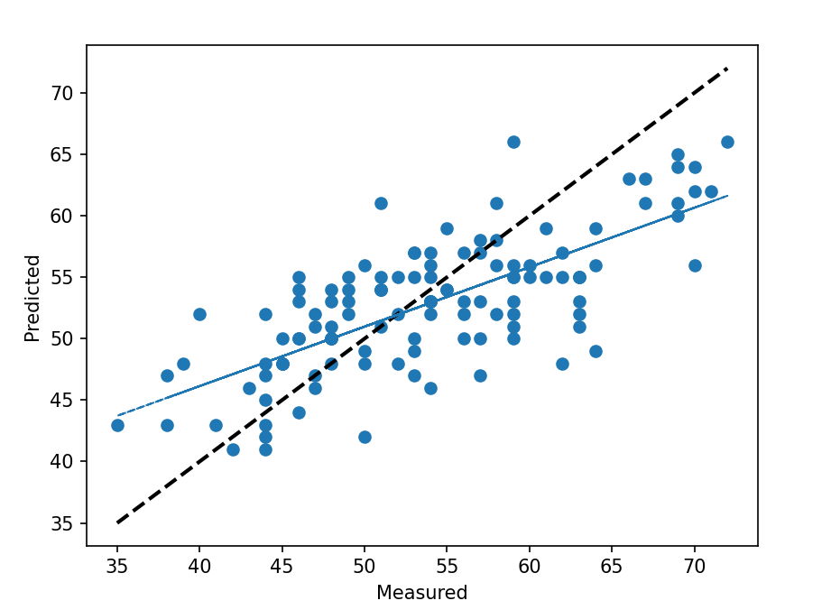

# Evaluating a Use of Regression Machine Learning Models for Predicting Morning RMSSD (3day EMA).

RMSSD (Root Mean Square of the Successive Differences) is a commonly used measure of heart rate variability (HRV), which refers to the variation in the time interval between consecutive heartbeats. RMSSD is often used as an indicator of vagal tone, which is a measure of the activity of the parasympathetic nervous system, which regulates the body's "rest and digest" functions. Higher HRV is generally associated with good physical and mental health, while lower HRV can indicate stress, fatigue, or other health problems.

This notebook implements a machine learning model for predicting the next morning's rmssd value. The data was retrieved from the "Athlete Data Warehouse" PostgreSQL database, which integrates athletic activity and lifestyle information from various sources, and was exported into a CSV file included with this notebook. The data is loaded into pandas dataframe then preprocessed and transformed by converting dates to numeric values, shifting up certain columns to exclude the values that will be predicted, and selecting relevant features. 
The code defines a function, return_morn_rmssd, that takes in the preprocessed data and returns a prediction of the next morning's rmssd value. The prediction is made using a combination of regression models including RandomForrestRegressor, MLPRegressor and xgboost. The code also includes various error metrics to evaluate the performance of the model such as, Pearson's corelation of predicted vs measured, mean squared error, mean absolute error, and mean absolute percentage error and plots the predicted vs measured values.

*Scatter Plot Measured vs Predicted:*

*Line Plot Measured vs Predicted:*

